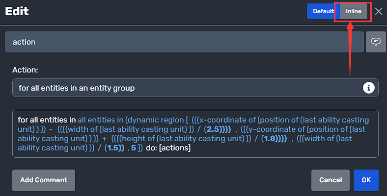
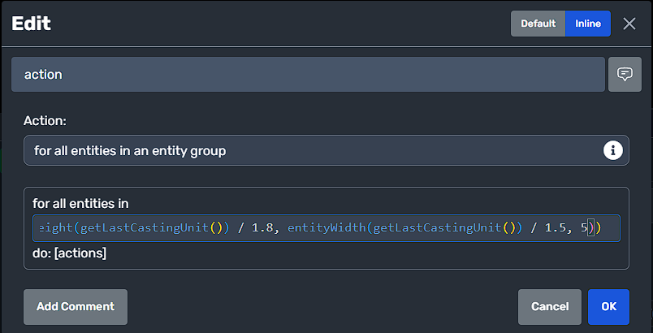
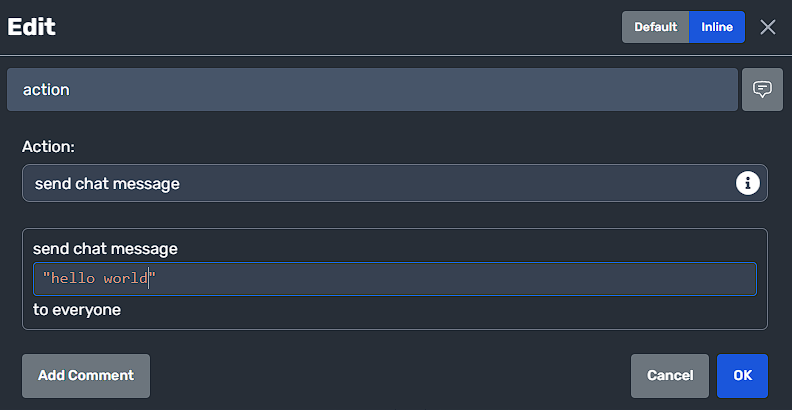

<table style="display: flex;justify-content: center;" id="moddioVersion">
<thead>
    <tr>
        <th>Moddio Version: 2.0.0</th>
        <th>(current)</th>
    </tr>
</thead>
<tbody></tbody>
</table>

# Inline-editing

Hello :D, are you tired of endlessly clicking on each slot in the script editor, ya, I know this feeling as well, if so then you can try the inline-editing.

Maybe, you have noticed that you can change the editing mode in script modal, 
But it's not the only way to change the editing mode, try **ctrl+q**


There is a magical feeling so right~ ♪, huhh, as you can see, the multi-nested object is getting flat, I mean u can edit every slots at same time, no need to click to go deep the nested object, especially useful for editing those numbers.

You can copy or paste here freely, enjoy xD.

---

And then let's start with the "hello world", the very classic one.

Choose the send chat message action in the drop down, change it to inline editing mode, and type "hello world", don't forget the quotes "", btw you can use '' as well, it's useful to wrap <code>string</code> with '', if you want to use "" in the <code>string</code>, like, 'once upon a time, some one said: "hello world" '

And for <code>string</code>, it's very useful to use inline-editing when u want to concat the <code>string</code> with <code>string</code> or <code>number</code>

> Try type

```js
"a random <code>number</code> = " + randNumber(0, 5);
```

> Tips  
 Inline-editing will auto handle <code>string</code> + <code>number</code>, if the addition equation contains the <code>string</code>, the output will be <code>string</code>, and <code>number</code> + <code>number</code> will be concat as <code>string</code>

```js
1 + 1 + "hello" // "11hello"
(1 + 1) + "hello"; // "2hello"
```

## action aliases

In inline-editing, we have many action aliases to simplified function calling, here is the table

| Function Name | Alias |
| --- | --- |
| getRandomNumberBetween | randNumber |
| xyCoordinate | pos |
| dynamicRegion | region |
| mathFloor | floor |
| squareRoot | sqrt |
| getRandomItemTypeFromItemTypeGroup | randItemType |
| stringToNumber | str2num |
| getPositionY | y |
| getPositionX | x |
| getXCoordinateOfRegion | x |
| getYCoordinateOfRegion | y |
| getItemTypeOfItem | type |
| getUnitTypeOfUnit | type |
| playerTypeOfPlayer | type |
| getRandomUnitTypeFromUnitTypeGroup | type |
| undefinedValue | undefined |
| getRandomPositionInRegion | randPos |
| substringOf | slice |
| absoluteValueOfNumber | abs |
| getExponent | pow |
| numberToString | num2str |
| stringToObject | str2obj |
| objectToString | obj2Str |
| unitsFacingAngle | facingAngle |
| getCurrentAmmoOfItem | currentAmmo |
| changeDescriptionOfItem | changeDesc |
| getOwnerOfItem | owner |
| setFadingTextOfUnit | setFadingText |
| getSensorOfUnit | sensor |
| getPositionInFrontOfPosition | polarProjection |
| lastPlayedTimeOfPlayer | lastPlayedTime |
| getLastPurchasedUnit | lastPurchasedUnit |
| getLastPlayerSelectingDialogueOption | lastSelectingDialogueOption |
| getTriggeringItem | triggeringItem |
| playerCustomInput | lastPlayerInput |
| getTriggeringRegion | triggeringRegion |
| getLastOverlappingUnit | lastOverlappingUnit |
| lastPurchasedUnitTypetId | lastPurchasedUnitType |
| getTriggeringPlayer | triggeringPlayer |
| getLastOverlappedUnit | lastOverlappedUnit |
| getLastCreatedItem | lastCreatedItem |
| getLastCreatedProjectile | lastCreatedProjectile |
| getLastTouchingUnit | lastTouchingUnit |
| getLastOverlappingItem | lastOverlappingItem |
| entityLastRaycastCollisionPosition | lastRaycastCollisionPos |
| getLastCastingUnit | lastCastingUnit |
| getLastTouchedUnit | lastTouchedUnit |
| getTriggeringProjectile | triggeringProj |
| getLastCreatedUnit | lastCreatedUnit |
| getTriggeringUnit | triggeringUnit |
| getLastTouchedItem | lastTouchedItem |
| getLastTouchedProjectile | lastTouchedProj |
| getLastOverlappingProjectile | lastOverlappingProj |
| getTriggeringAttribute | triggeringAttr |
| getLastAttackedUnit | lastAttackedUnit |
| getLastAttackingUnit | lastAttackingUnit |
| getLastChatMessageSentByPlayer | lastChatMessageSent |
| getLastAttackingItem | lastAttackingItem |

You can use these aliases directly, like pos(2, 5), created a position
> no worries! the complete suggestions will help you, no need to remember these aliases

## method & property
